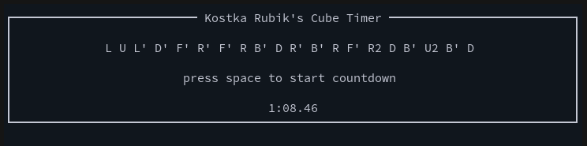

# Kostka: a TUI Rubik's Cube timer

This project is a Rubik's cube timer with a shuffle generator and a countdown.
It is written in Haskell using [brick](https://github.com/jtdaugherty/brick), a
TUI toolkit.

## Keybindings

* `q` to quit
* `s` to generate a new shuffle
* `<space>` to start/stop the timer

## Installation

This project requires **Haskell** and **cabal** to be built. If you have these
installed, simply clone this repo, `cd` into it's directory and run `cabal
install`.

## Future features

I will implement these if I feel like it

* Cooler color theme/layout
* Time history and stats, possibly persistent using a database
